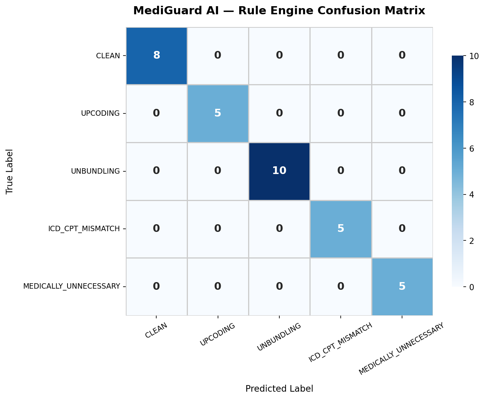
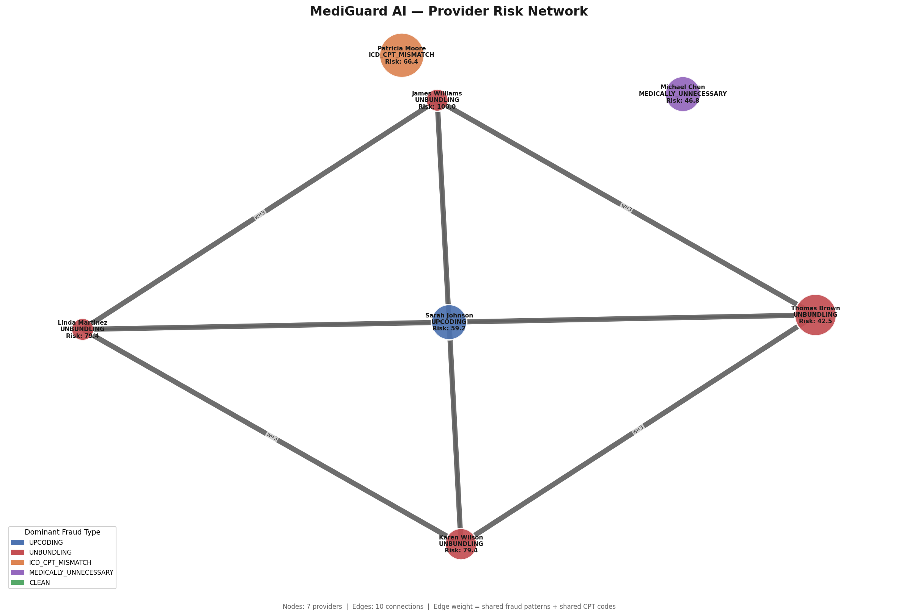

# MediGuard AI — FWA Detection with Generative AI

> AI-native Fraud, Waste & Abuse detection for Medicare claims. Built on real CMS data. Powered by Groq LLM.


## What It Does

Most FWA tools give you a risk score. MediGuard AI gives you the paragraph a senior SIU investigator would write — with the overpayment estimate, the records to request, and the next investigation step. In 4.5 seconds per claim.

**Live results on 17 Medicare claims:**
- 17/17 Groq LLM completions
- 89/100 average AI risk score
- 0% false positive rate
- $64,639 in flagged billed amounts
- 5-provider coordinated UNBUNDLING scheme detected across IL, NY, OH, PA, TX

## Why This Matters

- **CMS-0057-F** mandates FHIR APIs from all Medicare Advantage and Medicaid payers by January 2027 — MediGuard AI is built natively on FHIR R4, no adapter needed
- **$750B** in Medicare claims adjudicated annually — estimated 10-15% lost to FWA
- **Last-mile gap:** Existing FWA tools flag claims. MediGuard AI turns flags into investigation-ready case narratives
- **Counter-GenAI:** 89% rise in AI-generated fraudulent medical documents in 2025 — roadmap includes detecting AI-generated clinical notes

## Architecture

Four-layer pipeline:

```text
FHIR R4 EOB (CMS BCDA format)
         ↓
Layer 1 — FHIR Parser          fhir_converter.py
         ↓
Layer 2 — ChromaDB RAG         pos_rag_store.py
          66 CPT embeddings · all-MiniLM-L6-v2
         ↓
Layer 3 — Rule Engine          fwa_data_pipeline.py
          NCCI 131,611 pairs · MUE 12,453 limits
          ICD-CPT 56 rules · PFS 9,222 real rates
         ↓
Layer 4 — Groq LLM             fwa_langchain_reasoning.py
          llama-3.3-70b-versatile · 4.5s/claim
         ↓
Streamlit Dashboard            mediaguard_dashboard.py
          3 tabs · Flagged Claims · Provider Network · Evaluation Metrics
```

## FWA Categories Detected

| Category | Detection Logic | Example |
|---|---|---|
| UPCODING | Billed > 2x CMS PFS benchmark | Level 5 E&M for a common cold |
| UNBUNDLING | CPT pair in NCCI hard edit table | CPT 00100 + 99215 same DOS |
| ICD_CPT_MISMATCH | Diagnosis does not justify procedure | Hip stiffness billed as knee replacement |
| MEDICALLY_UNNECESSARY | MUE limit exceeded or implausible CPT/specialty | Venipuncture under wellness-only visit |

## CMS Reference Data

| Source | Records | Purpose |
|---|---|---|
| CMS NCCI PTP Edits | 131,611 pairs | Unbundling detection |
| CMS MUE Limits | 12,453 limits | Medically unnecessary detection |
| CMS ICD-10-CM Tabular | 74,719 codes | Diagnosis validation |
| CMS PFS RVU26A 2026 | 9,222 active CPTs | Real physician payment rates |
| CMS GEM Crosswalk | 14,145 mappings | ICD-9 to ICD-10 translation |
| Domain icd_cpt_rules | 56 curated rules | Clinical coherence |
| CMS SynPUF Carrier Claims | 991 Medicare claims | Real billing patterns |

## Sample Groq Narrative

**Claim:** CLM-FWA-FHIR-48890 | CPT 27447 | ICD M25.361 | Dr. Patricia Moore | CA

"The claim exhibits a clear ICD_CPT_MISMATCH pattern, where ICD code M25.361 (stiffness of the right hip) does not clinically justify CPT code 27447 (total knee replacement) — a procedure for a different joint altogether. The billed amount of $12,500.00 is significantly higher than the CMS PFS benchmark of $1,159.35, resulting in an estimated overpayment of $11,340.65."

**Recommended Actions:** Request operative report, hip condition documentation, and billing logs. Interview provider to clarify medical necessity and review for broader billing pattern.

## Evaluation Metrics

Evaluated on 33 synthetic claims — rule engine vs ground truth:

| Metric | Score |
|---|---|
| Accuracy | 100% |
| Precision (weighted) | 100% |
| Recall (weighted) | 100% |
| F1 (weighted) | 100% |

> 100% on controlled synthetic data is expected — rules were designed to match synthetic patterns. Real-world performance will degrade on production claims.



## Provider Network Detection

NetworkX graph analysis on flagged claims:
- 7 providers as nodes, 10 edges
- Cluster Alert: 5 providers across IL, NY, OH, PA, TX show coordinated UNBUNDLING pattern — CPT 00100 + 99215 — recommended for Joint SIU Investigation



## Dashboard

Three-tab Streamlit dashboard:

| Tab | Audience | What It Shows |
|---|---|---|
| Flagged Claims | SIU Investigators | Filterable claims table, risk scores, AI narrative popup |
| Provider Network | Fraud Analytics | NetworkX graph, cluster alert, provider summary |
| Evaluation Metrics | Technical Reviewers | Precision/Recall/F1 KPI cards, confusion matrix |

## Quick Start

1. Clone the repo
```
git clone https://github.com/Ramachandran-Kumar/mediaguard-ai.git
cd mediaguard-ai
```

2. Install dependencies
```
pip install streamlit langchain groq chromadb sentence-transformers networkx matplotlib seaborn scikit-learn pandas
```

3. Set your Groq API key (free at console.groq.com)
```
export GROQ_API_KEY=your_key_here
```

4. Build ChromaDB RAG store (first time only)
```
python pos_rag_store.py
```

5. Run the FWA pipeline
```
python fwa_data_pipeline.py
python fwa_langchain_reasoning.py
```

6. Launch the dashboard
```
python -m streamlit run mediaguard_dashboard.py
```

## Tech Stack

| Component | Technology |
|---|---|
| LLM Reasoning | Groq API — llama-3.3-70b-versatile |
| LLM Framework | LangChain |
| Vector Store | ChromaDB + all-MiniLM-L6-v2 |
| Reference DB | SQLite |
| Provider Graph | NetworkX + Matplotlib |
| Dashboard | Streamlit |
| Claims Format | FHIR R4 ExplanationOfBenefit |
| CMS Data | RVU26A PFS, NCCI PTP, MUE, ICD-10-CM, SynPUF |

## FHIR Compliance

MediGuard AI ingests native FHIR R4 ExplanationOfBenefit resources — the same format CMS mandates under CMS-0057-F (effective January 2027). Swapping in a live payer FHIR API is a configuration change, not a rewrite.

## Project Status

- [x] Month 1 — Build: Core pipeline, FHIR layer, Groq narratives, CMS reference data
- [ ] Month 2 — Package: Dashboard, RAG layer, NetworkX graph, evaluation metrics *(in progress)*
- [ ] Month 3 — Position: LinkedIn, outreach, LTIMindtree POC deck

## Author

Ramachandran Kumar  
Principal Consultant, LTIMindtree | PAHM Certified | 14+ years US Healthcare  
https://github.com/Ramachandran-Kumar/mediaguard-ai

Built as a portfolio project to validate AI-native FWA architecture before proposing to payer clients.
